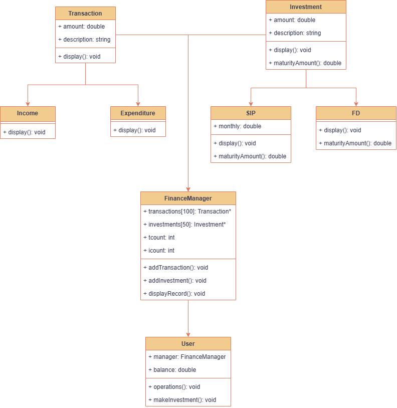

# Personal Finance Management System

## Overview

This C++ Personal Finance Management System is a versatile console-based application designed to help users manage their financial transactions and investments. It offers a range of features for recording income, expenses, and making investments, with built-in calculations for maturity amounts.

## Features

- **User Account**: Create an account with an initial balance.

- **Record Income and Expenses**: Keep track of income and expenses, with balance validation to prevent overspending.

- **Investments**: Invest in two types:
  - **Systematic Investment Plan (SIP)**: Set up monthly investments with calculated maturity amounts.
  - **Fixed Deposit (FD)**: Create fixed deposits with calculated maturity amounts.

- **Record Keeping**: Maintain a history of all transactions and investments.

- **Financial Information**: Check the current balance and view a detailed history of income and expenses.

- **Investment Information**: Monitor the maturity amounts and key investment details.

- **User-Friendly Menu**: Interactive menu for user-friendly operations.

## Class Diagram



## Getting Started

1. **Clone the Repository**: Clone or download the code from this repository.

2. **Compile the Code**: Use a C++ compiler to build the program.

   ```bash
   g++ main.cpp -o main
   ```

3. **Run the Program**:

   ```bash
   ./main
   ```

4. **Use the Menu**: Follow the on-screen menu to perform operations, record transactions, and make investments.

5. **Exit the Program**: Close the program when you're done.

6. **INPUT and OUTPUT**:
    ```shell-session
    ---Welcome to Finance Management System!!---
    
    --OPTIONS--
    1. Record INCOME
    2. Record EXPENDITURE
    3. Make Investment
    4. Finance Information
    5. Investment Information
    0. Exit
    Enter choice : 1
    Enter amount : 5000
    Enter description : Salary
    
    --OPTIONS--
    1. Record INCOME
    2. Record EXPENDITURE
    3. Make Investment
    4. Finance Information
    5. Investment Information
    0. Exit
    Enter choice : 2
    Enter amount: 2000
    Enter description: Rent
    
    --OPTIONS--
    1. Record INCOME
    2. Record EXPENDITURE
    3. Make Investment
    4. Finance Information
    5. Investment Information
    0. Exit
    Enter choice : 3
    
    Which one:
    1. SIP
    2. FD
    0. Go back
    Enter your choice : 1
    Enter amount : 500
    Enter duration in yrs : 5
    Enter monthly investment amount : 100
    
    Which one:
    1. SIP
    2. FD
    0. Go back
    Enter your choice : 2
    Enter amount : 800
    Enter duration in yrs : 6
    
    Which one:
    1. SIP
    2. FD
    0. Go back
    Enter your choice : 0
    
    --OPTIONS--
    1. Record INCOME
    2. Record EXPENDITURE
    3. Make Investment
    4. Finance Information
    5. Investment Information
    0. Exit
    Enter choice : 4
    -----------------------------------
    |        Personal Finance        |
    -----------------------------------
    
    ||--BALANCE--: 3700||
    
    --SAVINGS--:
               Type         Amount         Description
             Income           5000              Salary
        Expenditure           2000                Rent
    
    --INVESTMENTS--
               Type         Amount       Duration       Monthly amount invested
                SIP            500              5                 100
                 FD            800              6
    
    --OPTIONS--
    1. Record INCOME
    2. Record EXPENDITURE
    3. Make Investment
    4. Finance Information
    5. Investment Information
    0. Exit
    Enter choice : 5
    --MATURITY AMOUNTS--||
    
    Investment 1 : 6806.5 Rs
               Type         Amount            Duration       Monthly amount invested
                SIP            500              5                 100
    
    Investment 2 : 1207.33 Rs
               Type         Amount            Duration       Monthly amount invested
                 FD            800              6
    
    --OPTIONS--
    1. Record INCOME
    2. Record EXPENDITURE
    3. Make Investment
    4. Finance Information
    5. Investment Information
    0. Exit
    Enter choice : 0
    
    ```
    
## Disclaimer

This finance management system is for educational purposes and doesn't offer real financial advice or services. The interest rates used for investment calculations are fictional. Real financial decisions should be made with professional guidance.

## Authors

[Onkar Mendhapurkar](https://github.com/onkar69483)

[Mihir Hebalkar](https://github.com/mihirhebalkar)

[Sachin Mhetre](https://github.com/Sachin-Mhetre)

## License

This project is open-source and available under the [MIT License](LICENSE). Feel free to modify and use the code for personal or educational purposes.

## Acknowledgments

- This project was developed as a practical educational exercise.
- Thanks to the C++ community for support and inspiration.
